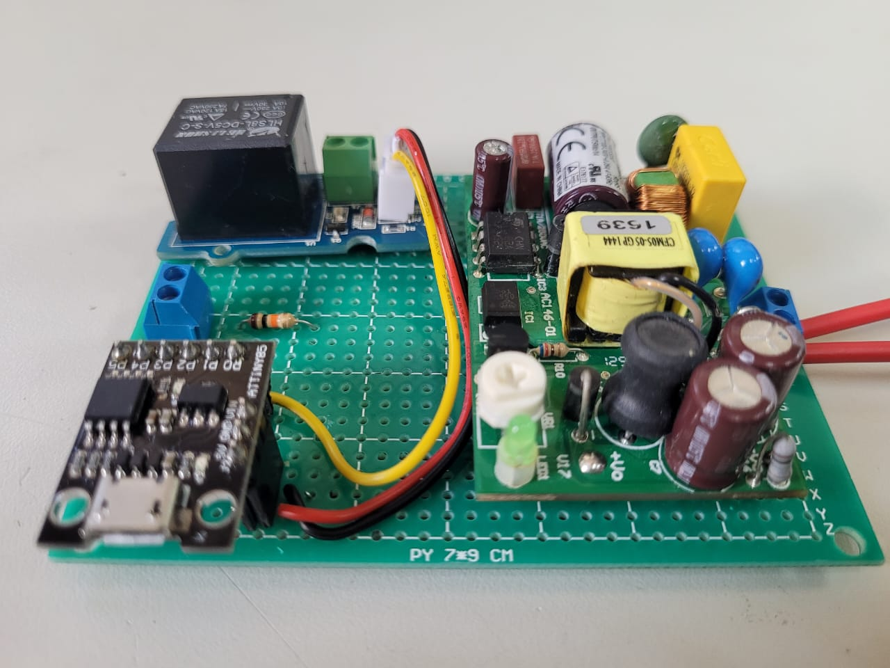

# attiny85_parking_lights
Project made using attiny85 in order to activate parking lights at the client's house and set a timer to turn off.

## Project operation

The application will wait for a command from a dry contact, which will send a command to the PBO port. This dry contact will be sent by an end-of-switch sensor connected to the customer's rail gate. This will activate the relay, releasing the parking lot lighting system phase and activating the door marking relay.

After the customer enters and the gate closes, the lights will continue to be on due to the timer that will count from the moment the dry contact opens. After 5 minutes, the lights turn off and everything returns to its initial state.

## Board prototype

